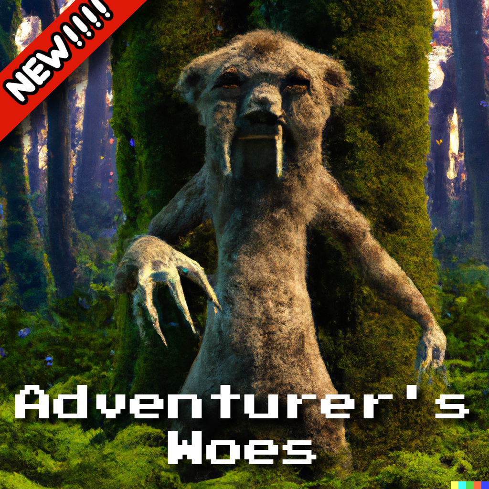

# Adventurer's Woes

My love for old style adventure games has lead to this development. Thanks for playing.

## Description

Adventurer's Woes is a short choose your own adventure game made using Html, Css, and JavaScript about the decisions and paths that some may take as an adventurer.

## Getting Started

### Requirements

* Requires latest version of OS
* ex. Windows 10

### 💥 [GAME](https://adventurers-woes.netlify.app/) 💥

### How To Play

* Click Here [GAME](https://adventurers-woes.netlify.app/)
* Click Reset
* Use dropdown to make selection

## Assets

* [Google Drive](https://drive.google.com/drive/folders/12MLLKKpNPBz7X5H0w5UYDksSF6fjjAGP?usp=sharing)

## Technologies Used

Inspiration, code snippets, etc.

* VS Code
* Git
* HTML
* CSS
* JavaScript
* Dall-E 2